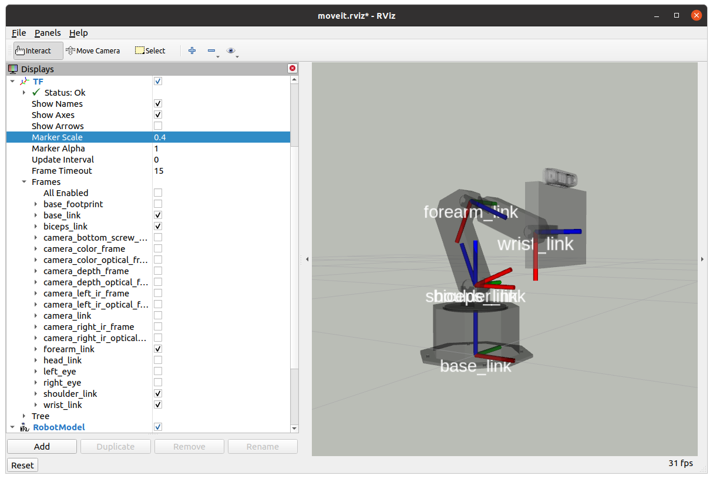
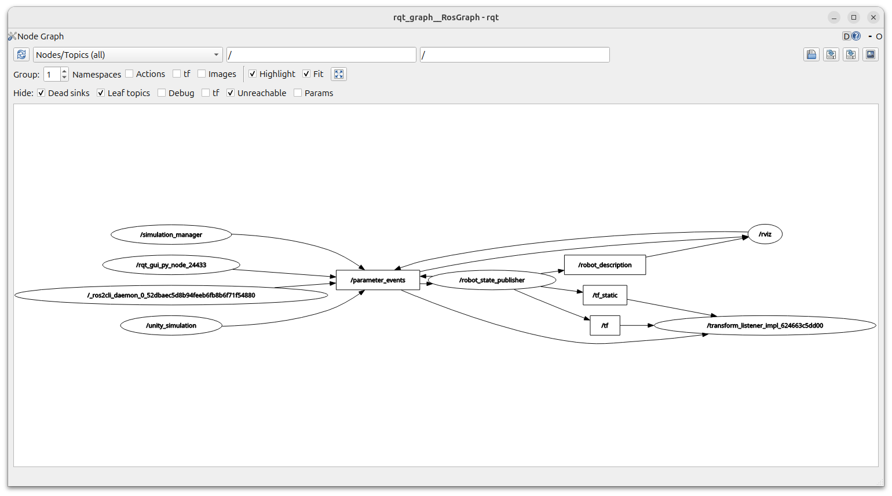

# Setting up your ROS 2 Workspace

## Table of Contents

  * [Part 0 - Install dependencies](#part-0---install-dependencies)
  * [Part I - Set up your workspace to work with Shutter](#part-i---set-up-your-workspace-to-work-with-shutter)
  * [Part II - Test out Shutter's Simulation](#part-ii---test-out-shutters-simulation)

## Part 0 - Install dependencies

You should have access to a computer with `Ubuntu 24.04` and `ROS 2 Jazzy` to complete the assignments in this repository. The instructions below assume that you are using a [bash shell](https://www.gnu.org/software/bash/) to do the assignments, and that you have installed the *desktop-full* Jazzy version of ROS 2 
using `apt-get` as in this guide: 
[https://docs.ros.org/en/jazzy/Installation/Ubuntu-Install-Debians.html](https://docs.ros.org/en/jazzy/Installation/Ubuntu-Install-Debians.html).

   > Note that all the dependencies that require sudo (admin permissions) are already installed in the Zoo machines and in the BIM laptops that registered students have access to for the course. Thus, you can skip the next apt install instructions and only run the pip commands that follow.

With ROS2 installed, in a terminal, run the following commands to install general system dependencies for Shutter's code:

```
$ sudo apt install ros-jazzy-turtle-tf2-py
$ sudo apt install ros-jazzy-cv-bridge
$ sudo apt install python3-vcstool
$ sudo apt install python-is-python3
$ sudo apt install python3-tk
$ sudo apt install python3-pip
$ sudo apt-get install python3-rosdep python3-colcon-common-extensions python3-rosinstall-generator build-essential
$ sudo -H apt-get install -y ros-jazzy-rosbridge-suite
$ sudo -H apt-get install -y ros-jazzy-usb-cam
$ sudo -H apt-get install -y ros-jazzy-xacro
$ sudo apt install python3-venv
$ sudo -H apt-get install -y ros-jazzy-joint-state-publisher
```

## Part I - Set up your workspace to work with Shutter

*Colcon* is the official build system for ROS 2. To understand what it is for and why it exists, 
read sections 1, 2 and 4 of Colcon's conceptual overview document: 
[https://colcon.readthedocs.io/en/released/user/quick-start.html](https://colcon.readthedocs.io/en/released/user/quick-start.html).

Set up your Colcon workspace to work with the Shutter robot:

1. Create a [workspace](https://docs.ros.org/en/jazzy/Tutorials/Beginner-Client-Libraries/Creating-A-Workspace/Creating-A-Workspace.html) called *ros2_ws* 
in your home directory. To do this, follow steps 1-2 in this tutorial: 
[https://docs.ros.org/en/jazzy/Tutorials/Beginner-Client-Libraries/Creating-A-Workspace/Creating-A-Workspace.html](https://docs.ros.org/en/jazzy/Tutorials/Beginner-Client-Libraries/Creating-A-Workspace/Creating-A-Workspace.html)

    > The [tutorial](https://docs.ros.org/en/jazzy/Tutorials/Beginner-Client-Libraries/Creating-A-Workspace/Creating-A-Workspace.html) page is written for different ROS distributions. Follow the tutorial for the distribution of ROS 2 that you have installed in your system, i.e., Jazzy.

    > To make the ROS commands accessible in a terminal, you need to `$ source /opt/ros/jazzy/setup.bash`. You can add this line to the end of the configuration file for your shell (e.g., add it at the end of `~/.bashrc` for a bash shell) so that you do not have to source the `setup.bash` ros file every time you open a new terminal.
    
    > There is no need to install the sample repo in the tutorial in your workspace. If you do, though, you may need to install other dependencies to run your code, which may require sudo. There is no need to do that for this assignment and we cannot provide you sudo in the Zoo machines or BIM laptops.

2. Download Shutter's codebase into your workspace's `src` directory.

    ```bash
    # Go to the src folder in your workspace
    $ cd ~/ros2_ws/src

    # Clone the Shutter packages from GitLab
    $ git clone https://gitlab.com/interactive-machines/shutter/shutter-ros2.git
 
    # Load git submodules with ROS dependencies
    $ cd shutter-ros2
    $ git submodule update --init
    ```
    
    > [Git submodules](https://git-scm.com/book/en/v2/Git-Tools-Submodules) are other,
    external projects (Git repositories) that have been included in 
    the shutter-ros2 repository. These projects are needed to run the robot's base code.
    
    You should now have a number of directories in ~/ros2_ws/src/shutter-ros2, including:
    
    ```bash
    $ cd ~/ros2_ws/src
    $ ls -C1 shutter-ros2
    documentation
    shutter_bringup
    shutter_description
    (...)
    ```
    
    Some of these directories are standard folders, other are ROS 2 packages. 
    A ROS 2 package contains:
    
    1. A [package.xml](https://docs.ros.org/en/jazzy/Tutorials/Beginner-Client-Libraries/Creating-Your-First-ROS2-Package.html#write-a-package-xml-file) file
    that contains basic information about the package, e.g., package name, description,
    license, author, dependencies, etc.
    
    2. A [CMakeLists.txt](https://docs.ros.org/en/jazzy/Tutorials/Beginner-Client-Libraries/Creating-Your-First-ROS2-Package.html#write-a-cmakelists-txt-file) file that is 
    used by colcon to build the software package.
    
    For example, the shutter_bringup package has the following files:
    
    ```bash
    # Example
    $ ls -C1 ~/ros2_ws/src/shutter-ros2/shutter_bringup
    CMakeLists.txt
    config
    launch
    package.xml
    README.md
    (...)
    ```
    
    > Each ROS 2 package must have its own folder. This means that there cannot be
    nested packages. Multiple packages cannot share the same directory.
    
    Read the README.md file in the root level of the 
    [shutter-ros2](https://gitlab.com/interactive-machines/shutter/shutter-ros2.git) repository
    to understand its content and general organization. You can also access the documentation for shutter-ros at [https://shutter-ros.readthedocs.io](https://shutter-ros.readthedocs.io). 

3. In `~/ros2_ws/src/shutter-ros2/modules/ROS-TCP-Endpoint/setup.cfg`, update "script-dir" to "script_dir", and "install-scripts" to "install_scripts". This change is necessary to fix for an installation error that can occur with modern versions of setuptools when installing [ROS-TCP-Endpoint](https://github.com/Unity-Technologies/ROS-TCP-Endpoint) in your workspace.

    > For this course, we have created a simulation of the Shutter robot with the Unity game engine. This simulation utilizes the ROS-TCP-Endpoint package to connect to ROS. If you want to know more about how this works, check out the Unity Robotics Hub documentation [here](https://github.com/Unity-Technologies/Unity-Robotics-Hub/blob/main/tutorials/ros_unity_integration/README.md).

4. Build the packages in the src directory of your workspace with `colcon build`. 

    ```bash
    # Build your workspace
    $ cd ~/ros2_ws
    $ colcon build --cmake-args -DCMAKE_BUILD_TYPE=Release
    ```

    (again, be patient...)

    Now you should have an install space in `~/ros2_ws/install`, which contains its own `setup.bash` file.
    Sourcing this file will `overlay` the install space onto your environment. 
    
    > Overlaying refers to building and using a ROS 2 package from source on top of an existing version of that same package (e.g., installed at the system level in /opt/ros/jazzy). For more information on overlaying, read [this tutorial](https://docs.ros.org/en/jazzy/Tutorials/Beginner-Client-Libraries/Creating-A-Workspace/Creating-A-Workspace.html#source-the-overlay).

    > Note that the `colcon build` command generated a `build` directory when it compiled the code in your `src` folder. This `build` directory has intermediary build files needed during the compilation process to generate the executables and libraries in the `install` folder. 
    If you ever need to, you can delete the `build` and `install` folders and re-run `colcon build` within `ros2_ws` to recompile everything from scratch.

5. Configure your bash environment. First, add ```source /opt/ros/jazzy/setup.bash``` and ```source ~/ros2_ws/install/setup.bash``` at the end of your `.bashrc` file to automatically set up your environment with your workspace every time you open a new shell. Otherwise, make sure to source ~/ros2_ws/install/setup.bash on every new shell that you want to use to work with ROS 2. Sourcing setup.bash from your install space will ensure that ROS 2 can work properly with the code that you've added to and built in ~/ros2_ws. Second, add ```export ROS_AUTOMATIC_DISCOVERY_RANGE="LOCALHOST"``` at the end of your `.bashrc` file to ensure that ROS 2 only runs on your local network. 

    > By default, ROS 2 will search for nodes on all computers within your network's computer. Thus, it is critical that you setup the auatomatic discovery range to `LOCALHOST`.

Because it is likely that multiple students in BIM will end up using the same machine for the assignments, we ask you to please set up a `ROS_DOMAIN_ID` that is unique to you in the class. This will minimize the chances that when you are working on the assignment, someone else's node interferes with your work. You should set up this variable in your `~/.bashrc` file: ```export ROS_DOMAIN_ID=X``` where X is the number next to your name in this [list](https://yale.instructure.com/courses/108557/files/folder/Data?preview=11520447).

6. Install Python dependencies in a virtual environment:

    ```
    # (Important) Open a new terminal
    $ source /opt/ros/jazzy/setup.bash     # only necessary if the command is not in the .bashrc file
    $ source ~/ros2_ws/install/setup.bash  # only necessary if the command is not in the .bashrc file
    $ cd ~/ros2_ws/
    $ python3 -m venv --system-site-packages .venv   # create a new Python virtual environment
    $ source .venv/bin/activate         # activate the virtual environment
    $ pip3 install gdown          # install library to download Shutter simulation
    $ colcon build --cmake-args -DCMAKE_BUILD_TYPE=Release    # build the ros workspace again
    ```

    To run any ROS commands in a new terminal in the future, you should first source the ROS 2 environment and then activate the Python virtual environment.
    ```
    $ cd ~/ros2_ws/
    $ source /opt/ros/jazzy/setup.bash     # only necessary if the command is not in the .bashrc file
    $ source ~/ros2_ws/install/setup.bash  # only necessary if the command is not in the .bashrc file
    $ source .venv/bin/activate
    ```

    When running commands on a terminal, pay attention to the information that is printed in the terminal. If you see any errors,
    please post them in Ed discussion and/or communicate with the course T.F.       

## Part II - Test out Shutter's Simulation

Now that you have setup Shutter's code in your colcon workspace, you will simulate
the Shutter robot and use basic ROS 2 tools to gather information about 
[ROS 2 nodes](https://docs.ros.org/en/jazzy/Tutorials/Beginner-CLI-Tools/Understanding-ROS2-Nodes/Understanding-ROS2-Nodes.html)
-- processes that perform computation in your ROS 2 system -- and 
[ROS 2 messages](https://docs.ros.org/en/jazzy/Tutorials/Beginner-CLI-Tools/Understanding-ROS2-Topics/Understanding-ROS2-Topics.html) -- data being sent from one node to another.
     
1. Open another terminal, source your environment, and *bring up* a simulated version of the Shutter robot 
with [ros2 launch](https://docs.ros.org/en/jazzy/Tutorials/Beginner-CLI-Tools/Launching-Multiple-Nodes/Launching-Multiple-Nodes.html).

    ```bash
    $ source /opt/ros/jazzy/setup.bash     # only necessary if not sourced already through the .bashrc file
    $ source ~/ros2_ws/install/setup.bash  # only necessary if not sourced already through the .bashrc file
    $ source .venv/bin/activate
    $ ros2 launch shutter_bringup demo.launch.py use_sim_time:=true
    ```
    
    > Ros2 launch is a tool for easily launching and configuring multiple ROS 2 nodes. Instead of starting each node in a separate terminal, a launch file allows you to start them all with a single command, automatically setting their specific configuration parameters. You will often be working with launch files in your assignments.
    
    The demo.launch.py file will do many things: 
    
    1. It will run another launch file (shutter_bringup/launch/shutter_unity.launch.py) which will open up the Unity simulation of the robot and set up a dedicated TCP connection between ROS 2 and Unity. The simulation code will be downloaded from Google Drive if this is the first time you are running the simulation in your workspace.
    
    2. It will run a [robot_state_publisher](https://docs.ros.org/en/jazzy/Tutorials/Intermediate/Tf2/Tf2-Main/Tf2-Main.html) node that publishes 
    information about the coordinate frames within the body of the robot as well as a description of the robot body. The information about the frames is sent to [tf2](https://docs.ros.org/en/jazzy/Tutorials/Intermediate/Tf2/Tf2-Main/Tf2-Main.html), which handles all coordinate transforms in the ROS system. The description of the robot is in [URDF format](https://docs.ros.org/en/jazzy/Tutorials/Intermediate/URDF/URDF-Main/URDF-Main.html). In particular, the URDF model has information about the the joints of the robot and its sensors, including specific properties and relative placement.

        > The robot description is published through the `/robot_description` topic. You can see the information being sent through this topic using the `ros2 topic echo /robot_description` in a terminal.

        > About ROS 2 Parameters: In ROS 1, the robot model used to be stored in a system-level parameter in ROS. But, unlike ROS 1, ROS 2 does not have a central parameter server. Instead, each node maintains its own set of parameters. These parameters are used to configure the node at runtime without needing to recompile code. While parameters are managed by individual nodes, they are still accessible across the entire ROS 2 system. You can use command-line tools (like `ros2 param list` and `ros2 param get <node_name> <param_name>`) to inspect and change a node’s parameters. Launch files are the most common way to set initial parameter values when a system starts up. This parameter system is best used for static, non-binary data such as configuration settings.

    3. It will launch [RViz2](https://docs.ros.org/en/jazzy/Tutorials/Intermediate/RViz/RViz-Main.html) as a visualization interface. RViz can be used to visualize many things in the ROS system, including the state of the robot (e.g., as published via the `/robot_description` topic).

2. Try commanding the robot from the command line. You can send specific requests for the position of each
of the 4 joints in the robot as follows:

    ```bash
    $ ros2 topic pub --once /unity_joint_group_controller/command std_msgs/msg/Float64MultiArray "data: [0.0, -1.5, -1.0, 0.0]"
    ```

    The [ros2 topic](https://docs.ros.org/en/jazzy/Tutorials/Beginner-CLI-Tools/Understanding-ROS2-Topics/Understanding-ROS2-Topics.html) tool used above publishes a message to the `/unity_joint_group_controller/command` topic. This message has [std_msgs/msg/Float64MultiArray](https://docs.ros2.org/api/std_msgs/msg/Float64MultiArray.html) as type.This type has two fields `data` and `layout`, but the above command only sets the `data` field to "[0.0, -1.5, -1.0, 0.0]". 
    
    Each of the values in the array correspond to the position of one joint in Shutter (in radians). That is, the command requests the robot to set its first joint (the servo in the base of the robot) to the position "0.0" radians, which makes the robot look forward. Similarly, the command requests that the robot sets its second joint to the position "-1.54" radians. You can try sending other servo positions to the robot by repeating the command line above with different values for the `data` field.

    > Note that the Unity simulation would stop the robot from moving upon self-collisions. For example,
    if you send the command above with: "data: [0.0, -1.5, -1.0, -2.0]" then the robot would only
    reach a position close to [0.0, -1.5, -1.0, -1.57]. You can check which position the robot has at any time during the simulation with the following command:

    ```bash
    $ ros2 topic echo /joint_states
    ```

3. Visualize the main coordinate frames of the robot's arm in RViz2, as shown in the image below:

    

    To get this visualization, add a [tf2 Display](https://docs.ros.org/en/jazzy/Tutorials/Intermediate/Tf2/Tf2-Main/Tf2-Main.html) in RViz2
    and then select the corresponding frames in the tf2/Frames submenu on the left panel.

    Each coordinate frame in the robot associated with a [link](https://docs.ros.org/en/jazzy/Tutorials/Intermediate/URDF/URDF-Main/URDF-Main.html): 

    1. `base_link`, which is at the very bottom of the robot with the $x$ axis (red) pointing forward; 
    2. `shoulder_link`, which is above `base_link` and allows the robot to rotate left and right (yaw angle); 
    3. `biceps_link`, which is above `shoulder_link` and allows the robot's head to move forward and backward;
    4. `forearm_link`, which allows the head to move up and down; and
    5. `wrist_link`, which allows the head to tilt.

    The above 5 links make up a significant portion the kinematic chain of the robot.

    > Note that the robot has many more frames than the 5 links mentioned above. Some of these additional frames
    do not correspond to real robot links (specific rigid bodies) but were added to the robot's model (its URDF description)
    for convenience. For example, there are coordinate frames (like `left_eye`) for helping control the eye's of the robot when rendered in 
    its screen.


4. Finally, use [rqt_graph](https://docs.ros.org/en/jazzy/Tutorials/Beginner-CLI-Tools/Understanding-ROS2-Nodes/Understanding-ROS2-Nodes.html) to visualize the 
[nodes](https://docs.ros.org/en/jazzy/Tutorials/Beginner-CLI-Tools/Understanding-ROS2-Nodes/Understanding-ROS2-Nodes.html) that are currently running
in your ROS 2 system and the [topics](https://docs.ros.org/en/jazzy/Tutorials/Beginner-CLI-Tools/Understanding-ROS2-Topics/Understanding-ROS2-Topics.html) that are being used to 
exchange information between nodes.

    ```bash
    $ ros2 run rqt_graph rqt_graph
    ```
    
    Uncheck the "Group" options (e.g., "Namespaces" and "Actions") in rqt_graph, uncheck the "Debug", "tf" and "Params" options under "Hide", and select "Nodes/Topics(all)" to visualize all of the nodes that are sharing information in the graph. You should see a total of 7 `ROS 2 nodes` (displayed as ellipses) in the graph: 

    

    The nodes in the picture above include:
    
    - /robot_state_publisher
    - /rqt_gui_py_node_XXXXX
    - /unity_simulation
    - /simulation_manager
    - /rviz...
    <br/>
    
    > The full name of the rqt_graph node includes numbers XXXXX, which indicate that the
    program was run as an anonymous node. The numbers were generated 
    automatically when the node was initialized to provide the program a unique name, e.g.,
    in case you want to run multiple versions of rqt_graph. More information about initializing nodes
    in C++ or Python can be found 
    [here](https://docs.ros.org/en/jazzy/Tutorials/Beginner-Client-Libraries/Writing-A-Simple-Cpp-Publisher-And-Subscriber.html) or 
    [here](https://docs.ros.org/en/jazzy/Tutorials/Beginner-Client-Libraries/Writing-A-Simple-Py-Publisher-And-Subscriber.html), respectively.
    
    The nodes are connected in the graph through `ROS 2 topics` (displayed as squares). 
    ROS 2 topics are named buses over which data [messages](https://docs.ros.org/en/jazzy/Tutorials/Beginner-CLI-Tools/Understanding-ROS2-Topics/Understanding-ROS2-Topics.html) are exchanged. 
    There can be multiple publishers and subscribers to a topic. 
    
    > In general, nodes are not aware of who they are communicating with. 
    Instead, nodes that are interested in data *subscribe* to the relevant topic; 
    nodes that generate data *publish* to the relevant topic. 
    
    For example, the node /robot_state_publisher publishes messages to the /robot_description topic. Thus, you should see a directed edge in the graph from the node to the topic. 
    
    > The node [rosout](https://docs.ros.org/en/jazzy/Tutorials/Beginner-CLI-Tools/Understanding-ROS2-Nodes/Understanding-ROS2-Nodes.html) is a "dead sink" in the sense that it does not have subscribers in the current state of the ROS system. It can be revealed in `rqt_graph` by disabling the option to hide "dead sinks". Rosout implements a system-wide logging mechanism for messages sent to the /rosout topic. You can read more about logging in ROS 2 [here](https://docs.ros.org/en/jazzy/Concepts/Intermediate/About-Logging.html).
    
At this point, please continue setting up your assignment repository as in the [SETUP1_GitAssignmentRepo.md](SETUP1_GitAssignmentRepo.md) instructions.
