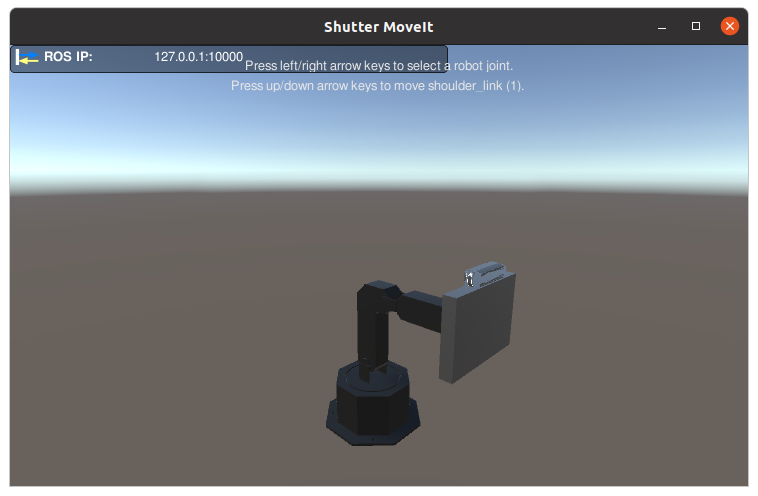
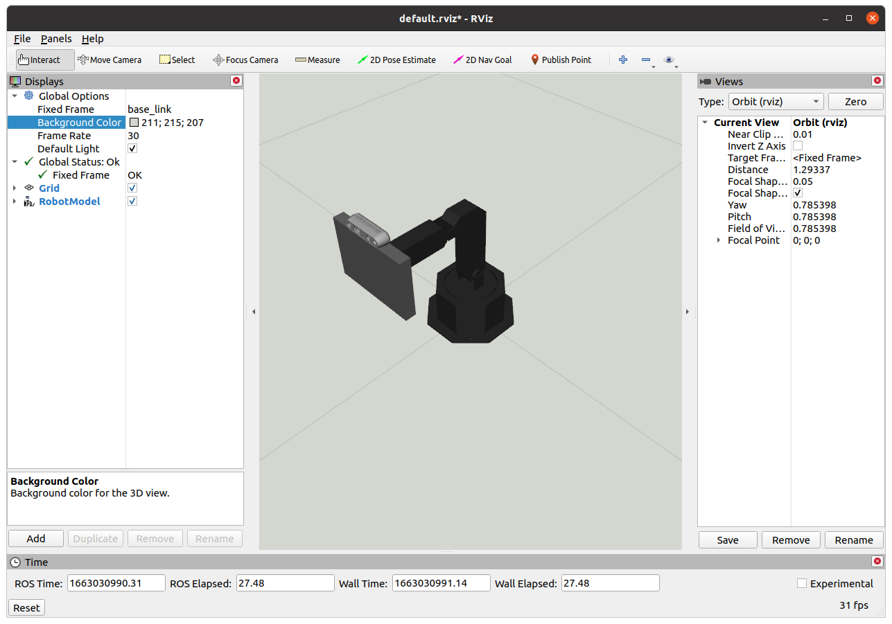
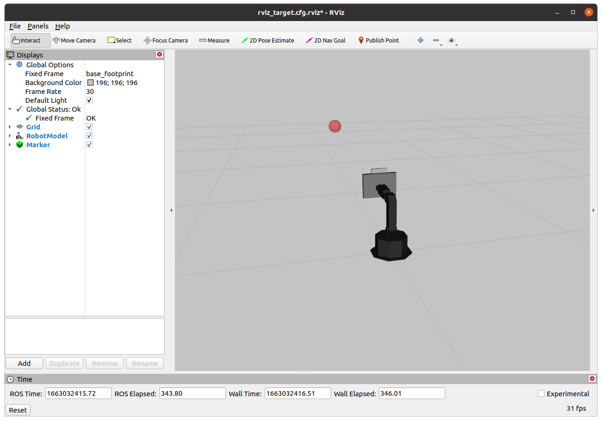
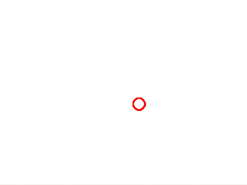
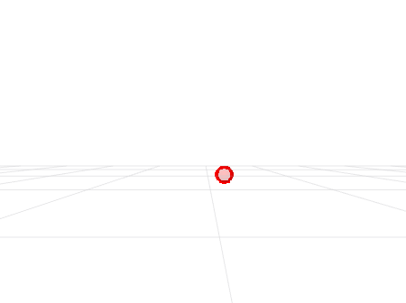
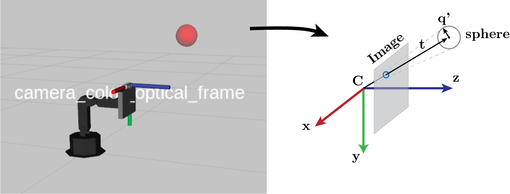
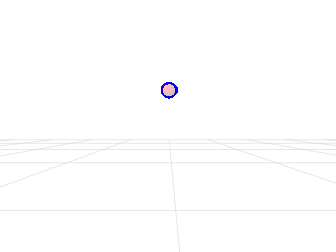

# Assignment 1

This is the first assignment for Yale's CPSC-4590/5590 Building Interactive Machines course.

## Table of Contents

* [Introduction](#introduction)
    * [System Requirements](#system-requirements)
    * [Background Knowledge](#background-knowledge)
    * [Deliverables](#deliverables)
    * [Evaluation](#evaluation)
    * [Further Reading and Tutorials](#further-reading-and-tutorials)
* [Preliminaries](#preliminaries)
    * [Notation](#notation)
    * [Conventions](#conventions)
    * [Kinematic Chains](#kinematic-chains)
    * [3D Transformations](#3d-transformations)
    * [Changing the Frame of a Point](#changing-the-frame-of-a-point)
    * [Transforms in ROS](#transforms-in-ros)
* [Setup](#setup)<br><br>
* [Part I. Introduction to tf2](#part-i-introduction-to-tf2)
    * [Questions / Tasks](#questions--tasks)
* [Part II. Publishing tf2 messages](#part-ii-publishing-tf2-messages)
    * [Questions / Tasks](#questions--tasks-1)
* [Part III. Making a virtual camera](#part-iii-making-a-virtual-camera)
    * [Questions / Tasks](#questions--tasks-2)
* [Part IV. Making a fancier virtual camera](#part-iv-making-a-fancier-virtual-camera)
    * [Questions / Tasks](#questions--tasks-3)
* [Parts V and VI](#parts-v-and-vi)  (only for students taking CPSC-559)

## Introduction 
This assignment will provide you practical experience with the [tf2](https://docs.ros.org/en/humble/Tutorials/Intermediate/Tf2/Tf2-Main.html) ROS 2 package, 
the pinhole camera model, and inverse kinematics. You will also practice
a bit of geometry, e.g., to transform points across coordinate frames.

#### System Requirements
This assignment should be completed in Ubuntu 24.04 with ROS 2 Jazzy. Before beginning the assignment, you need to first
complete the set up instructions in [SETUP0..md](../SETUP0_ROSWorkspace.md) and [SETUP1..md](../SETUP1_GitAssignmentRepo.md), which will
help you create your ROS 2 workspace and create your Git assignment repository.

#### Background Knowledge

This assignment assumes that you are familiar with
the `ros2 run`, `ros2 launch`, `ros2 topic`, `rqt_graph`, and `rviz2` tools (explained in [SETUP0..md](../SETUP0_ROSWorkspace.md)). You
should also know how to control the position of Shutter's joints one at a time in simulation. If
you are unfamiliar with any of these tools, programs, or procedures, please revisit [SETUP0..md](../SETUP0_ROSWorkspace.md).

#### Deliverables

- **Report:** You are expected to submit a pdf to Gradescope with answers to the questions/tasks at 
the end of each part of the assignment. This report should also have any information needed 
to understand and/or run your code, as well as the specific commit SHA of your final version of 
the code for this assignment. The report is a fillable PDF which is available [here for CPSC 4590 Students](https://drive.google.com/file/d/1GG6HcnvvUBLNyvtf3S7ZQc-V-7lyItFG/view?usp=sharing) and [here for CPSC 5590 Students](https://drive.google.com/file/d/1oTm6KCGF8tBotK1k_TuZHm2fTX_3N8lp/view?usp=sharing). 

    Use the latest version of [Adobe Acrobat Reader DC](https://get.adobe.com/reader/) or [Adobe Acrobat Pro DC](https://www.adobe.com/acrobat/acrobat-pro.html) to fill this PDF in Windows or OSX. You can get Reader DC for Windows and OSX from the [Yale Software Library](https://software.yale.edu/software/adobe-reader-dc). 
    
    In Ubuntu 24.04, you can install Acrobat Reader DC with [wine](https://en.wikipedia.org/wiki/Wine_(software)) by following [these instructions](https://linuxconfig.org/how-to-install-adobe-acrobat-reader-dc-wine-on-ubuntu-20-04-focal-fossa-linux).
    Note that you might need to install [Windows 7 fonts](https://www.w7df.com/p/windows-7.html) in Ubuntu for the Reader program to work properly (see [these instructions](https://askubuntu.com/a/1103305) to install the fonts).
    You are expected to fill out the fields in the report with your answers in text form or as images, as indicated by the PDF.

- **ROS 2 Bag:** You are expected to provide a link to [ROS 2 bags](https://docs.ros.org/en/jazzy/Tutorials/Beginner-CLI-Tools/Recording-And-Playing-Back-Data/Recording-And-Playing-Back-Data.html) in your
 assignment report (see Parts III of this assignment). ROS 2 bags can be hosted in [Google drive](https://drive.google.com) 
 or [Box](https://yale.account.box.com) -- you should ensure that the teaching staff can access your ROS 2 bags.

- **Code:** Finally, you are expected to push code for this assignment to your 
[GitHub](http://www.github.com) repository as explained in [SETUP1..md](../SETUP1_GitAssignmentRepo.md). You should submit your final code via Gradescope for evaluation.

#### Evaluation

You assignment will be evaluated based on the content of your report and your code:

- Report 
    - Part I (9 pts): I-1 (3 pts) + I-2 (3 pts) + I-3 (3 pts)
    - Part II (4 pts): II-2 (4 pts) 
    - Part III (7 pts): III-2 (2 pts) + III-3 (5 pts)
    - Part IV (15 pts): IV-1 (3 pts) + IV-2 (5 pts) + IV-3 (4 pts) + IV-6 (3 pts)
    - Part V (10 pts): V-1 (10 pts)
    - Part VI (10 pts): VI-1 (8 pts) + VI-3 (2 pts)
- Code
    * Part II-1 (20 pts) 
    * Part III (37 pts): Virtual Camera (24 pts) + III-1 (8 pts) + III-4 (5 pts) 
    * Part IV (8 pts): IV-4 (4 pts) + IV-5 (4 pts)
    * Part VI (10 pts): VI-2 (4 pts) + VI-3 (6 pts)

Students taking CPSC-459 will be evaluated over 100 pts. Those taking CPSC-559, will be evaluated over 130 pts.

#### Further Reading and Tutorials

- [tf2: The Transform Library](https://docs.ros.org/en/jazzy/Tutorials/Intermediate/Tf2/Tf2-Main.html)
- [Introduction to Robotics: Mechanics and Control](https://www.pearson.com/us/higher-education/program/Craig-Introduction-to-Robotics-Mechanics-and-Control-4th-Edition/PGM91709.html) by J. Craig (see Chapters 3 and 4 for more information on manipulator kinematics)

## Preliminaries

Begin by reading these [preliminary notes](PRELIMINARIES.md) about ROS and transformations.

## Setup
Before you start implementing or answering questions for this assignment, please update
your repository to pull the latest changes from the assignments repository and update
the shutter-ros2 repository:

```bash
# update your repository with the latest version of the assignment
$ cd <path-to-your-repository-in-your-workspace>
$ git pull upstream main

# update the shutter-ros2 repository 
$ cd <path-to-your-ros2-workspace>/src/shutter_bringup
$ git pull

# finally, re-build your colcon workspace 
$ cd <path-to-your-ros2-workspace-root-directory>
$ colcon build --cmake-args -DCMAKE_BUILD_TYPE=Release
```

> Tip: If you cannot find the shutter_bringup directory in your workspace's src folder,
then you have not properly set up your workspace. Check carefully how to set up your workspace
in the [SETUP0..md](../SETUP0_ROSWorkspace.md) instructions.


## Part I. Introduction to tf2
This part of the assignment will help you understand how [tf2](https://docs.ros.org/en/humble/Tutorials/Intermediate/Tf2/Tf2-Main.html) lets 
users keep track of multiple coordinate frames over time in ROS 2. 

> NOTE: When this tutorial refers to `tf2`,
it refers to the second version of the tf package. This is the standard transform library in ROS 2.

1. Read the [Introduction to tf2](https://docs.ros.org/en/jazzy/Tutorials/Intermediate/Tf2/Introduction-To-Tf2.html) tutorial from ROS 2. You should familiarize yourself with the `view_frames.py` and `tf2_echo` tools from [tf2_tools](https://docs.ros.org/en/jazzy/Tutorials/Intermediate/Tf2/Tf2-Main.html). You should also learn to visualize tf2 transforms in with [RViz2](https://docs.ros.org/en/jazzy/Tutorials/Intermediate/Tf2/Introduction-To-Tf2.html).

    > If you are using Zoo machines or BIM laptops, then `ros-jazzy-turtle-tf2-py`, `ros-jazzy-tf2-tools`, and `ros-jazzy-tf2` should already be installed in the computer.

2. Run a simulation of Shutter (without MoveIt):

    ```
    $ ros2 launch shutter_bringup shutter.launch.py simulation:=true use_sim_time:=true
    ```

    You should then see the Unity simulator come up:

    

3. Then, open up RViz2 using the [ros2 run](https://docs.ros.org/en/jazzy/Tutorials/Beginner-CLI-Tools/Understanding-ROS2-Nodes/Understanding-ROS2-Nodes.html) tool:

    ```
    $ ros2 run rviz2 rviz2 --ros-args -p use_sim_time:=true
    ```

    > The `ros2 run <package> <executable>` tool above allows you to run an executable in an arbitrary ROS 2 package. In the above command in particular,
    you are running the `rviz2` executable (second argument to ros2 run) in the [rviz2](https://docs.ros.org/en/jazzy/Tutorials/Intermediate/Tf2/Introduction-To-Tf2.html) package (first argument).

4. Change the `Fixed Frame` to "base_link" in rviz2's Global Options panel. This will ensure
that the robot's model is shown straight up in the middle of the 3D visualization area of rviz2.
    
5. Change your background color to a light color (e.g., light gray) in the Global Options as well.
    
6. Add a `RobotModel` display to rviz2. Click on the "Add" button in the Displays panel, and
a window will pop up. Then, look for the "rviz2" plugins folder, and select RobotModel. Then, in the Displays panel, expand RobotModel, and select "/robot_description" in the drop-down list of Description Topic, You should then see a simplified model of the robot in rviz2, as in the figure below.

    

    The [RobotModel Display type](https://docs.ros.org/en/jazzy/Tutorials/Intermediate/Tf2/Introduction-To-Tf2.html) shows
    the [links](https://docs.ros.org/en/jazzy/Tutorials/Intermediate/URDF/URDF-Main.html) of the robot according to 
    the URDF model published by the shutter.launch.py script.
    Each link describes a rigid body in the robot with physical, geometrical, 
    and visual features. 
    
    The RobotModel display also uses the [/tf](https://docs.ros.org/en/jazzy/Tutorials/Intermediate/Tf2/Tf2-Main.html) transform 
    tree to position the links of the robot in their respective current location.
    The information in the /tf topic is updated by the /robot_state_publisher node based
    on the messages that the Unity simulation publishes to the /joint_states topic.


### Questions / Tasks
Now you will inspect the robot's tf2 tree with tf2 tools. 

- **I-1.** Generate an image of the tf2 tree of Shutter with [view_frames.py](https://docs.ros.org/en/jazzy/Tutorials/Intermediate/Tf2/Tf2-Main.html). 
Include this image in your report.

    > Tip: You can also generate the image with the 
    [rqt_tf_tree](https://docs.ros.org/en/jazzy/Tutorials/Intermediate/Tf2/Tf2-Main.html) interface if you prefer.

- **I-2.** Based on the tf2 tree from I-1, which frames are between the robot's *base_footprint* 
frame and the *camera_color_optical_frame* frame?

- **I-3.** Based on the tf2 tree, what is the <!--$`4 \times 4`$--> transformation <!--$`^{C}_{O}T`$-->
from the *camera_color_optical_frame* frame (<!--$`O`$-->) to the *camera_link* frame (<!--$`C`$-->)? Please
provide the transformation with both the rotation and translation components.

    > Tip 1: You can use the [tf2_echo](https://docs.ros.org/en/jazzy/Tutorials/Intermediate/Tf2/Tf2-Main.html) tool to query
    transformations. You will then need to assemble the <!--$`4 \times 4`$--> homogenous transformation matrix 
    from these values. We recommend [this primer](http://wiki.ogre3d.org/Quaternion+and+Rotation+Primer) from Ogre
    if you are confused about different rotation representations.

    > Tip 2: We recommend that you visualize the frames of interest in RViz2 to ensure that the transformation that
    you are computing is in the right direction. Note that 
     is not the same as
    .

## Part II. Publishing tf2 messages
As mentioned earlier, the [tf2](https://docs.ros.org/en/jazzy/Tutorials/Intermediate/Tf2/Tf2-Main.html) library
uses a tree structure to represent frames and transformations in ROS 2. These frames and transformations
are created based on the messages streamed through the /tf and /tf_static topics. 

By convention, the /tf and /tf_static topics 
transmit messages of the type [tf2_msgs/msg/TFMessage](https://docs.ros2.org/jazzy/api/tf2_msgs/msg/TFMessage.html). In turn, these messages
 contain a list of transformations encoded as 
[geometry_msgs/msg/TransformStamped](https://docs.ros2.org/jazzy/api/geometry_msgs/msg/TransformStamped.html) messages.
Each [geometry_msgs/msg/TransformStamped](https://docs.ros2.org/jazzy/api/geometry_msgs/msg/TransformStamped.html) 
message has:

- a `header`, with a `stamp` of when the transform was published 
and the `frame_id` of the parent frame for the transformation;
- a `child_frame_id`, corresponding to the name of the child frame; and
- a `transform`, of type [geometry_msgs/msg/Transform](https://docs.ros2.org/jazzy/api/geometry_msgs/msg/Transform.html),
with the translation and rotation of the transform <!--<sup>parent</sup><sub>child</sub>$`T`$-->.

You will use code that is already provided in this assignment to learn how to publish tf2
data as described above. To get started, follow the steps below:

1. Inspect the `generate_target.py` Python script in the `scripts` directory of the `shutter_lookat` 
package that is provided as part of this assignment. You should understand how the script creates a 
simulated moving object and publishes its position relative to the "base_footprint" frame of 
Shutter through the `/target` topic.

2. Visualize the moving target in [RViz2](https://docs.ros.org/en/jazzy/Tutorials/Intermediate/Tf2/Introduction-To-Tf2.html). Before running the launch
script below, make sure that you are not running any other node in ROS 2.

    ```bash
    $ ros2 launch shutter_lookat generate_target.launch.py
    ```

    The launch script should then open RViz2 and display the robot and the moving target in front
    of it. The target should be displayed as a red ball.
    
        
    
    > [Ros2 launch](https://docs.ros.org/en/jazzy/Tutorials/Intermediate/Launch/Creating-Launch-Files.html) is a tool for easily launching multiple
    ROS 2 nodes. Ros2 launch scripts are written in Python format, according to [this specification](https://docs.ros.org/en/jazzy/Tutorials/Intermediate/Launch/Creating-Launch-Files.html).

   

### Questions / Tasks
Let's now publish the position of the moving object as a ROS 2 tf2 frame.

- **II-1.** Follow the steps below to make a new ROS 2 node that publishes 
the position of a simulated moving object as a ROS 2 tf2 frame ("target") relative
to the robot's "camera_color_optical_frame" frame. 

    - Create a new ROS 2 node in Python within the `scripts` directory of the `shutter_lookat` package.
The node should be named `publish_target_relative_to_realsense_camera.py`. The python script should have executable permissions.

    - Within your new node:
    
        - Subscribe to the `/target` topic to receive the position of the
simulated object relative to the "base_footprint" frame.

            > Tip: We suggest that you organize the code of your node
in a Python class, as in [this tutorial on a ROS 2 node](https://docs.ros.org/en/jazzy/Tutorials/Beginner-Client-Libraries/Writing-A-Simple-Py-Publisher-And-Subscriber.html),
given the increased complexity of this node in comparison previous examples. For Ubuntu 24.04, make sure to use 
`#!/usr/bin/env python3` instead of `#!/usr/bin/env python` to define your node as a Python executable, as Ubuntu 24.04 and ROS 2 Jazzy are meant to work with Python 3.

        - Transform the 3D pose of the moving object to the "camera_color_optical_frame" frame in Shutter.
        For this, you will have to query the transformation between the "base_footprint" frame in which the target pose is provided
        and the "camera_color_optical_frame" using the `lookup_transform` function from the tf2 API. 
        Make sure to query the transformation at the time when the target pose was computed.

            > Tip 1: You can take a look at this ROS 2 tutorial on [writing a tf2 listener](https://docs.ros.org/en/jazzy/Tutorials/Intermediate/Tf2/Writing-A-Tf2-Listener-Py.html)
            for some examples on using the tf2 API.
             
            > Tip 2: You can use the [tf2_geometry_msgs](https://index.ros.org/p/tf2_geometry_msgs/) API to transform the pose of the object
            as in [this post](https://answers.ros.org/question/222306/transform-a-pose-to-another-frame-with-tf2-in-python/).
            
        - Broadcast a tf2 transform between the "camera_color_optical_frame" frame (parent) and a new "target" frame (child) in tf2. 
        The target frame should match the pose of the simulated object in the camera_color_optical_frame.
        
            > Tip: An example on broadcasting tf2 transformations can be found in 
            [this tutorial](https://docs.ros.org/en/jazzy/Tutorials/Intermediate/Tf2/Writing-A-Tf2-Broadcaster-Py.html).
        
    - Close all your nodes in ROS 2, launch the `generate_target.launch.py` script, and run your new node which publishes
    the `target` frame:

        ```bash
        $ ros2 run shutter_lookat publish_target_relative_to_realsense_camera.py --ros-args -p use_sim_time:=true
        ```
    
    - Add a TF display to RViz2, and verify that the new `target` frame that you are publishing
    visually matches the position of the moving target (red ball). If the frame and the moving
    object are not displayed in the same place, check your code and edit as necessary.
    
    - Run public tests for this part of this assignment to ensure that your node is operating as expected:
    
        ```bash
        $ colcon test --packages-select shutter_lookat_public_tests --event-handlers console_direct+ --ctest-args -R test_publish_target
        ```
      
        If you want to see how the tests are implemented, check the `shutter_lookat_public_tests` package that is 
        provided as part of this assignment. More specifically, the tests for Part II are implemented in 
        `shutter_lookat_public_tests/test/test_publish_target.py`.
    
    - Save your work by adding and committing your publish_target_relative_to_realsense_camera.py
    script to your local repository. Push your code to GitHub.
     
        > Remember that continously committing your work and pushing to GitHub will ensure that your
        code is backed up and readily accessible in the future.
    
- **II-2.**  Stop any ROS 2 processes that you are running, relaunch the 
    `generate_target.launch.py` script, run your `publish_target_relative_to_realsense_camera.py` node, and create a new image of the tf2 tree in ROS 2, e.g., using [view_frames.py](https://docs.ros.org/en/jazzy/Tutorials/Intermediate/Tf2/Tf2-Main.html) or [rqt_tf_tree](https://docs.ros.org/en/jazzy/Tutorials/Intermediate/Tf2/Tf2-Main.html). 
    Add the image of the tf2 tree to your report.


## Part III. Making a virtual camera
Assume that the moving object from Part II of this assignment is a sphere. Now, you will 
work on projecting the simulated object on a virtual image captured from Shutter. Close all ROS 2 nodes before
starting this part of the assignment.

0. Install OpenCV and [cv_bridge](https://docs.ros.org/en/jazzy/Tutorials/Intermediate/Cv-Bridge/Cv-Bridge-Python.html) in Ubuntu 24.04 if they are not already installed: `sudo apt install ros-jazzy-cv-bridge`

1. Inspect the `virtual_camera.py` node that is provided as part of this assignment within the `shutter_lookat/scripts`
directory.  

2. Complete the `project_3D_point()` function at the top of the script. This function receives the coordinates of a 
3D point with coordinates x, y, z in the camera frame and computes the projected location for this point onto the image
using the camera's intrinsic matrix K.

3. Complete the `draw_image()` function at the top of the script. This function receives the coordinates of a 
3D point in the camera frame and renders an image with a circle representing the projected location of the point onto the image
plane.

    a. The `draw_image()` function should first create an empty image using the [OpenCV library](https://opencv.org/). 
    The image should have white background and dimensions of width x height pixels. An example on how you can create an image 
    with opencv is provided below:
    
    ```python
    # Example code
    import cv2          # import opencv
    import numpy as np  # import numpy
    
    # create image
    image = np.zeros((height, width, 3), np.uint8) # width and height are the dimensions of the image
    # color image
    image[:,:] = (255,255,255) # (B, G, R)
    ```
   
    b. The `draw_image()` function should then compute the projected location for the 3D target onto the image.
    To this end, the `draw_image()` function should call the `project_3D_point()` function, passing the 3D coordinates
    and intrinsic camera matrix K.
    
    c. The `draw_image()` function should draw the outline of a red circle on the image. 
    The position of the center of the circle should match the position of the projected 3D point in the image. Make
    the radius of the circle 12 pixels, and its outline 3 pixels wide.
    
    ```python
    # Example code
    cv2.circle(image, (x,y), radius, (0,0,255), outline_width) # (x,y) is the projected location of the target on the image
    ```
    
    > Tip: See the official [OpenCV documentation](https://docs.opencv.org/4.2.0/dc/da5/tutorial_py_drawing_functions.html) 
    for more examples on drawing basic figures.

    d. The `draw_image()` function should return the image with the drawn circle.

4. Edit the `__init__()` function of the `virtual_camera.py` node to define an instance variable K of type numpy array. 
This array should correspond to the 3x3 intrinsic camera matrix of your virtual camera. In particular, it should be defined 
based on the following parameters:

    ```python
    cx=320       # x-coordinate of principal point in terms of pixel dimensions
    cy=240       # y-coordinate of principal point in terms of pixel dimensions
    fx=349       # focal length in terms of pixel dimensions in the x direction
    fy=349       # focal length in terms of pixel dimensions in the y direction
    # note: assume there's no skew.
    ```
   
    > Tip: If you are unsure of what the above parameters mean, read more about projective cameras 
    in Hartly & Zisserman's [Multiple View Geometry](http://www.robots.ox.ac.uk/~vgg/hzbook/) book.

5. Edit the `target_callback()` function in the `virtual_camera.py` node such that it repeats the steps below every time 
a new message from the /target topic is received. 

    **a.** Compute the target's pose in the "camera_color_optical_frame" frame (as in Part II of this assignment).

    **b.** Call the `draw_image()` function to create a virtual camera image that shows the projected location of the target
    as a circle. The resulting image should have dimensions of 640 x 480 pixels.
   
    **c.** Publishes the image that you created with OpenCV as a [sensor_msgs/msg/Image](https://docs.ros2.org/jazzy/api/sensor_msgs/msg/Image.html) message in ROS 2. You
    can use the [cv_bridge](https://docs.ros.org/en/jazzy/Tutorials/Intermediate/Cv-Bridge/Cv-Bridge-Python.html) library to convert the OpenCV image to
    an Image message. Note that the Image message should have a `header` with the current time as
    `stamp` and the "camera_color_optical_frame" frame as `frame_id`. The Image message should be published by your node
    through the `/virtual_camera/image_raw` topic.
    
    > Tip: Examples on converting OpenCV images to ROS 2 messages can be found
    in [this tutorial](https://docs.ros.org/en/jazzy/Tutorials/Intermediate/Cv-Bridge/Cv-Bridge-Python.html).
    
6. Launch the `generate_target.launch.py` script again, run your node:

    ```bash
    $ ros2 run shutter_lookat virtual_camera.py --ros-args -p use_sim_time:=true
    ```

    and visualize the images that your node is publishing using the 
[ros2 run rqt_image_view rqt_image_view](https://docs.ros.org/en/jazzy/Tutorials/Beginner-CLI-Tools/Understanding-ROS2-Topics/Understanding-ROS2-Topics.html) tool. You should see the red circle
moving in a circular path in the image (as in the Figure below). If this is not the case, please check your implementation of the
virtual_camera.py script.

<p align="center">
<kbd>

</kbd>
</p>

### Questions / Tasks
    
- **III-1.** Edit your virtual_camera.py script to enable your node to also publish 
 calibration parameters. Sharing the parameters will help other programs 
 reason geometrically about the images that your virtual camera generates. Note that the parameters should be published as a [CameraInfo](https://docs.ros2.org/jazzy/api/sensor_msgs/msg/CameraInfo.html) message through the `/virtual_camera/camera_info` topic, as indicated in the steps below.

    **a.** Import the [CameraInfo](https://docs.ros2.org/jazzy/api/sensor_msgs/msg/CameraInfo.html) message
    into your virtual_camera.py script.
    
    ```python
    # Example
    from sensor_msgs.msg import CameraInfo
    ```
    
    **b.** Create a function that builds CameraInfo messages from the calibration parameters
    provided in Part III of this assignment. You can use the code snippet below to this end.
    
    ```python
    def make_camera_info_message(stamp, frame_id, image_width, image_height, cx, cy, fx, fy):
        """
        Build CameraInfo message
        :param stamp: timestamp for the message
        :param frame_id: frame id of the camera
        :param image_width: image width
        :param image_height: image height
        :param cx: x-coordinate of principal point in terms of pixel dimensions
        :param cy: y-coordinate of principal point in terms of pixel dimensions
        :param fx: focal length in terms of pixel dimensions in the x direction
        :param fy: focal length in terms of pixel dimensions in the y direction
        :return: CameraInfo message with the camera calibration parameters.
        """
        camera_info_msg = CameraInfo()
        camera_info_msg.header.stamp = stamp
        camera_info_msg.header.frame_id = frame_id
        camera_info_msg.width = image_width
        camera_info_msg.height = image_height
        camera_info_msg.k = [fx, 0, cx, 0, fy, cy, 0, 0, 1]
        camera_info_msg.d = [0, 0, 0, 0, 0]
        camera_info_msg.r = [1, 0, 0, 0, 1, 0, 0, 0, 1]
        camera_info_msg.p = [fx, 0, cx, 0, 0, fy, cy, 0, 0, 0, 1, 0]
        camera_info_msg.distortion_model = "plumb_bob"
        return camera_info_msg
    ```
    
    > Note: Specific details about the fields of CameraInfo messages can be found 
     in its [message definition](https://docs.ros2.org/jazzy/api/sensor_msgs/msg/CameraInfo.html).
    
    **c.** Create a publisher for the CameraInfo messages in your node.
    
    ```python
    # Example
    camerainfo_pub = self.create_publisher(CameraInfo, "/virtual_camera/camera_info", 10)
    ```
    
    **d.** Publish a CameraInfo message whenever your node publishes an Image message. The
    CameraInfo message should have the same header as the Image message.
    
    ```python
    # Example (assumes that image_msg is the Image message that your node publishes for the virtual camera)
    camerainfo_msg = make_camera_info_message(image_msg.header.stamp,
                                              image_msg.header.frame_id,
                                              image_width,
                                              image_height,
                                              cx, cy,
                                              fx, fy)
    camerainfo_pub.publish(camerainfo_msg)
    ```

    > Note: If the code of your node was organized into a class structure, then you could create the camerainfo_msg
    message when a class instance is initialized and save it as a member of the instance for future use. When the images are then created, you
    would just need to copy the header of the image message into the pre-computed camerainfo_msg, and publish it. While in practice
    organizing the code this way won't make your program in this part of the assignment much faster given the speed of computers today, thinking about ways 
    to optimize the operation of your ROS 2 nodes so that the same computation is not repeated over and over unnecessarily is important for real-time systems.
    
    **e.** Finally, check that your node is publishing CameraInfo messages through the 
    /virtual_camera/camera_info topic with the [ros2 topic echo](https://docs.ros.org/en/jazzy/Tutorials/Beginner-CLI-Tools/Understanding-ROS2-Topics/Understanding-ROS2-Topics.html) tool.

    > Remember to commit your code whenever you want to save a snapshot of your work. 

- **III-2.** You will now verify that the image and the camera parameters that your node publishes 
are consistent with one another with the help of the RViz2 [Camera Plugin](https://docs.ros.org/en/jazzy/Tutorials/Intermediate/Tf2/Introduction-To-Tf2.html). 

    > The [Camera Plugin](https://docs.ros.org/en/jazzy/Tutorials/Intermediate/Tf2/Introduction-To-Tf2.html) creates a new rendering
window in RViz2 from the perspective of a camera using the CameraInfo message that your virtual_camera.py node publishes. 
The plugin also lets you overlay other displays that you have enabled in RViz2 on the rendered image. Your goal is to use these overlays to verify that
the virtual camera that you already implemented is working correctly. 

    Close all running ROS 2 nodes and re-launch the generate_target.launch.py script. Then run 
    your virtual_camera.py node and, once RViz2 opens, add a Camera display to the RViz2 window.
    Configure the camera plugin as follows:
    
        Image Topic: /virtual_camera/image_raw
        Image Rendering: background
        Overlay Alpha: 0.6
        Zoom Factor: 1

    The red circle from your /virtual_camera/image_raw image should then align in the RViz2 
    Camera plugin with the red ball of the simulated moving object (as in the Figure below). 
    If this is not the case, check and correct your implementation of the virtual_camera.py node.
       
    <p align="center">
    <kbd>
    
    </kbd>
    </p>

    > Tip: If parts of the robot are displayed in the camera plugin image, then you can remove them by temporarily disabling the RobotModel plugin in Rviz2.
    
    Once the image that is published by the virtual_camera.py script is consistent 
    with what the Camera plugin shows in RViz2, record a ROS 2 [bag](https://docs.ros.org/en/jazzy/Tutorials/Beginner-CLI-Tools/Recording-And-Playing-Back-Data/Recording-And-Playing-Back-Data.html) 
    as in [this tutorial](https://docs.ros.org/en/jazzy/Tutorials/Beginner-CLI-Tools/Recording-And-Playing-Back-Data/Recording-And-Playing-Back-Data.html). 
    The bag should have all of the messages that are streamed in your system for a duration of 8 seconds.
    
    ```bash
    $ timeout 8 ros2 bag record -o <your-name>_a1p3-2.bag -a
    ```
    
    > You can see a description of the arguments that `ros2 bag record` accepts [here](https://docs.ros.org/en/jazzy/Tutorials/Beginner-CLI-Tools/Recording-And-Playing-Back-Data/Recording-And-Playing-Back-Data.html). Make sure to start the generate_target.launch.py file and your virtual camera before starting to record the bag, or the bag might end up being empty!
    
    Inspect your ROS 2 bag with the [ros2 bag info](https://docs.ros.org/en/jazzy/Tutorials/Beginner-CLI-Tools/Recording-And-Playing-Back-Data/Recording-And-Playing-Back-Data.html) tool to verify that it contains messages
    for all of the following topics:
        
        * /joint_states 
        * /rosout   
        * /target  
        * /target_marker 
        * /tf         
        * /tf_static  
        * /virtual_camera/camera_info    
        * /virtual_camera/image_raw 
    
    Upload your ROS 2 bag to Google Drive or Box and <u>make it accessible to anybody with the link</u>. Then, 
    **provide a link to your ROS 2 bag in your report** for this assignment. You don't need to and 
    you shouldn't commit the bag to your repository! Otherwise, you will make your repository
    unnecessarily heavy.

- **III-3.** Explain in your report what happens with the projection of the target on the image
when the target is behind the camera? How and why is the image changed? To visualize this result, you can launch the `generate_target.launch.py` script with the optional parameter `target_x_plane:=<x>`, where \<x\> corresponds to the target's
x coordinate on the robot's "base_footprint" frame. Then inspect the images that your node generates.

- **III-4.** Your virtual camera could see behind it, but real cameras don't do that. Modify the `draw_image()` function in the virtual_camera.py node so that the part of your code that computes the projection of the target and draws the circle only executes if the target is in front of the camera. That is, these parts of your program should only execute if the Z component of the target's position in the camera coordinate frame is positive. If the Z component is zero or negative, the function should instead return an empty (white) image. In the latter case, the function should also print a warning message:

    ```python
    # example warning
    self.get_logger().warn("Warning: Target is behind the camera (z={})".format(z)) # z is the z coordinate for the target's center point relative to the camera frame
    ```
    
Run public tests for Part III of this assignment to ensure that your node is operating as expected:

 ```bash
 $ colcon test --packages-select shutter_lookat_public_tests --event-handlers console_direct+ --ctest-args -R test_virtual_camera
 ```

## Part IV. Making a fancier virtual camera
You will now modify your virtual_camera.py node so that instead of drawing a circle with a fixed radius for the target, 
it draws the true outline of the spherical target as seen by the camera. 

1. Copy your virtual_camera.py script into a new script called `fancy_virtual_camera.py`. The new script
should be located within the `shutter_lookat/scripts` directory. It should have executable permissions.

2. Change the name of the new node in the `super().__init__()` function to `fancy_virtual_camera`
and edit any other relevant documentation in your code to indicate that the program implements a fancier virtual camera for Shutter.

### Questions / Tasks

Solve the questions below and complete the corresponding programming tasks on your `fancy_virtual_camera.py` node 
such that it outputs better images of the target for your camera. In brief, you will need to modify the `draw_image()` function in the new node 
such that it computes a direction vector <!--$`\bold{q'}`$--> 
from the center of the 3D target to the edge of the sphere seen by the camera. Then, you will be able to draw the target's 
true shape by rotating the vector along a rotation axis in the direction of the target, and projecting the resulting 
3D points along the edge of the sphere onto the camera image.

<p align="center">

</p>

- **IV-1.** To get started, let <!--$`\bold{t} = [t_x\ t_y\ t_z]^T`$--> be the vector from the camera center to the center of the target 
in the camera coordinate frame (as shown in the image above). 
Additionally, let the camera coordinate frame be oriented such that the <!--$`\bold{z}`$--> axis points
forward. How can you mathematically calculate a vector <!--$`\bold{q}`$--> perpendicular to both <!--$`\bold{t}`$--> and the horizontal axis <!--$`\bold{x}`$--> of the
camera coordinate frame? Explain in your report.

- **IV-2.**  Now that you have computed a vector perpendicular to the direction towards the target (as seen by the camera), 
how can you scale this vector to have a length equal to the radius <!--$`R`$--> of the moving 3D sphere? Provide the equation that scales <!--$`\bold{q}`$--> as desired while
preserving its direction in your report.

- **IV-3.**  Let <!--$`\bold{q'}`$--> be the scaled vector 
from question IV-2. Explain mathematically in your report how can rotate this vector by an 
angle <!--$`\alpha`$--> along a normalized rotation axis aligned 
with the vector <!--$`\bold{t}`$--> from question IV-1.

    > Tip. [Wikipedia](https://en.wikipedia.org/wiki/Axis%E2%80%93angle_representation) is a convenient place to learn more about the axis-angle parameterization of rotations.

- **IV-4.**  Points along the edge of the sphere (as seen by the camera), can now be computed as: 
, <!--$`\bold{t} + rotate(\bold{q'}, \alpha)`$-->
where `rotate()` is a function that implements IV-3. Modify the `draw_image()` function in your new 
`fancy_virtual_camera.py` script to compute 20 3D points equally distributed along the edge of the sphere that is 
seen by the camera. The code that computes these points should replace the prior computation for the red circle from Part III
in your new `fancy_virtual_camera.py` script.

    Note that the radius of the sphere in the world is provided through the /target message (see the `radius` field). You
    should pass this value from the target callback to the `draw_image()` function using the optional keyworded arguments `kwargs`.
    More specifically, you should pass the value using the `radius` keyword: `draw_image(x, y, z, K, width, height, radius=target_msg.radius)`.
    
    > Tip: If you are not familiar with keyworded variable length arguments in Python, check [this guide](https://book.pythontips.com/en/latest/args_and_kwargs.html).
    
    Use the code below when you implement these changes to `draw_image()`. In particular, add the functions at the top level 
    of the fancy virtual camera script - that is, outside any other class or function. When you submit your assignment, 
    automated tests will check that the functions are working as expected for your evaluation.

   ```python
   def compute_q(pt, radius):
       """
       Compute q - a vector perpindicular to the target
       direction and the horizontal axis of the camera
       coordinate frame.
       pt: the point at the center of the sphere in the
           camera coordinate frame
       radius: the radius of the ball 
       """
       # replace the line that defines q below with your implementation for this function
       # but make sure to return a numpy array as the example q below
       q = np.array([0.,0.,0.])
       return q
   ```
   
   ```python
   def compute_rotation_axis(pt):
       """
       Compute normalized rotation axis in same direction
       as vector t from question IV-1.
       pt: the point at the center of the sphere in the
           camera coordinate frame
       """
       # replace the line below with your implementation for this function
       rotation_axis = np.array([0.,0.,0.])
       return rotation_axis
   ```
   
   ```python
   def rotate_q(q, rotation_axis, angle):
       """
       Rotate q around rotation_axis by the number of 
       radians specified by angle.
       q: perpindicular vector from IV-1 and IV-2
       rotation_axis: normalized rotation axis from IV-3
       angle: angle of rotation in radians
       """
       # replace the line below with your implementation for this function
       rotated_q = np.array([0.,0.,0.])
       return rotated_q
   ```
   
   You can run public tests for this part of this assignment to ensure that your node is operating as expected:

     ```bash
     $ colcon test --packages-select shutter_lookat_public_tests --event-handlers console_direct+ --ctest-args -R test_fancy_virtual_camera
     ```

- **IV-5.**  Add a few lines of code to the `draw_image()` function such that it draws a blue contour for the sphere on the image using OpenCV. The contour should connect the projected points on the image:

    ```python
    # Example
    pixel_array = np.zeros((N,2), dtype=np.int32) # N is the number of points on the contour
    (...) # compute the points as in IV-4
    cv2.drawContours(image, [pixel_array], 0, (255,0,0), 3)
    ```

    The resulting image should now show the blue polygon (and no red circle), as shown below:
    
    <p align="center">
    <kbd>
    
    </kbd>
    </p>

- **IV-6.**  Restart ROS 2 and re-run the generate_target.launch.py with the ball updating at a lower speed, and being closer to the camera:
    
    ```bash
    $ ros2 launch shutter_lookat generate_target.launch.py target_x_plane:=0.5 publish_rate:=1 # the publish rate for the target is in Hz
    ```
    
    Then restart your `fancy_virtual_camera.py` node and take a picture of your resulting camera image when the target is nearby one of the corners of the image. 
    The image should show the target being elongated; not having a perfectly circular shape anymore. Include this image in your report and explain why the target does not
    appear to be a perfect circle, especially towards the edge of the image.


## Parts V and VI

Parts V and VI of the assignment are only for students taking CPSC-5590 (graduate version of the course). See the tasks/questions in the [ExtraQuestions-CPSC559.md](ExtraQuestions-CPSC559.md) document.

**Once you get to the end of the assignment, remember to commit your code, push to GitHub, and indicate
in your assignment report the commit SHA for the final version of your code. Your code and report should be submitted to 
Gradescope.**
